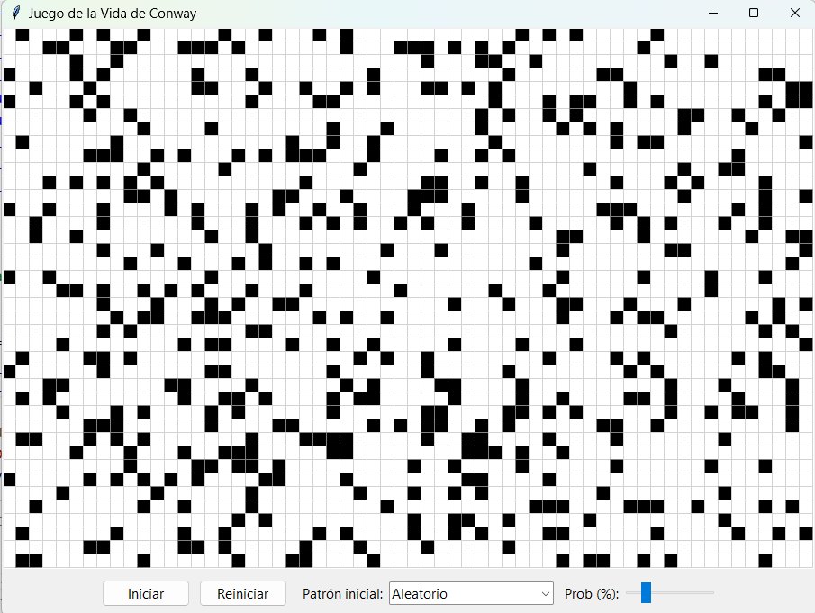

# 🦠 Proyecto de Laboratorio: Juego de la Vida
## Fundamentos de Programación 1. Grado en Ingeniería Informática – Inteligencia Artificial (Universidad de Sevilla)

El **Juego de la Vida** es un autómata celular creado en 1970 por el matemático John Horton Conway. No es un "juego" competitivo, sino una simulación de cómo patrones sencillos pueden generar comportamientos complejos a partir de reglas muy simples.

Originalmente se "jugaba" a mano, sobre papel cuadriculado o en un tablero de Go: se dibujaba una rejilla con celdas "vivas" y "muertas", y en cada turno se aplicaban las reglas mirando los ocho vecinos de cada celda. Las reglas clásicas son:

- Supervivencia: una celda viva sigue viva si tiene 2 o 3 vecinas vivas.
- Nacimiento: una celda muerta nace si tiene exactamente 3 vecinas vivas.
- Muerte: en otro caso, la celda muere o permanece vacía.

Estas reglas se van aplicando celda a celda del tablero, generando con ello un nuevo tablero. De nuevo con esta nueva configuración, se vuelven aplicar las reglas, y así sucesivamente. Con estos pasos, aparecen estructuras sorprendentes como "blinkers", "gliders" o "naves espaciales", que se descubrieron literalmente contando vecinos y actualizando el tablero a lápiz (o moviendo fichas).

Hoy podemos implementar el Juego de la Vida de forma sencilla en el ordenador: representaremos el tablero (por ejemplo, con una lista de listas o matriz), codificaremos las reglas de nacimiento/supervivencia/muerte y avanzaremos la simulación por generaciones. En esta práctica haremos precisamente eso: construir una versión básica, probar algunos patrones clásicos y observar cómo emerge la complejidad a partir de reglas mínimas.

Disponemos de una interfaz gráfica ya implementada, preparada para elegir configuraciones iniciales y reproducir la evolución del tablero. Sin embargo, aún están por implementar las distintas funciones que codifican las reglas del juego. Esta será tu tarea.

---

## Preparación del entorno

👉 Para configurar Git y clonar el repositorio del laboratorio, consulta **[instrucciones_git.md](https://github.com/FP1-25-26/FP1-LAB01-Calculadora-de-viajes-espaciales/blob/main/instrucciones_git.md)**.  

---

## ⏱ Duración estimada

2 horas

---

## ✅ ¿Qué se practica?

- Matrices (mediante listas de listas `list[list]`)
- Recorridos y operaciones sobre matrices

---

## 📁 Archivos del proyecto

Dispones de estos archivos en `src`:

| Archivo                  | Qué hace                                                                  |
|--------------------------|---------------------------------------------------------------------------|
| `vida_gui.py`      | Interfaz de usuario |
| `vida_utiles.py`   | Funciones a implementar por el estudiante
| `vida_utiles_test.py` | Pruebas de las funciones del módulo `vida_utiles.py`|

---

## 📌 Ejercicio 1: Función `crear_tablero`
Implementa la función `crear_tablero` que recibe el número de filas y de columnas y devuelve un nuevo tablero con todas las celdas iguales a `False`. El tablero se representa mediante una lista de filas, siendo cada fila una lista de celdas (una por columna). Por ejemplo, `crear_tablero(2, 3)` devolvería `[[False, False, False], [False, False, False]]`.

Prueba la función ejecutando las pruebas del módulo `vida_utiles_test.py`. 

## 📌 Ejercicio 2: Función `crear_tablero_aleatorio`
Implementa la función `crear_tablero_aleatorio` que recibe el número de filas y de columnas, y un valor `probabilidad_vida` comprendido entre 0 y 1. La función debe devolver un tablero del tamaño indicado con celdas aleatoriamente vivas o muertas. Para decidir si una celda está viva o muerta, puedes utilizar la función `random.random()`, que devuelve un valor aleatorio entre 0 y 1:
* Si `random.random() < probabilidad_vida`, la celda estará viva.
* Si no, estará muerta.

**Consejo**: puedes comenzar creando un tablero vacío del tamaño adecuado, llamando a la función `crear_tablero`. 

Prueba la función ejecutando las pruebas del módulo `vida_utiles_test.py`. 

## 📌 Ejercicio 3: Función `insertar_patron`
Implementa la función `insertar_patron` que recibe un tablero, un patrón y dos enteros `pos_fila` y `pos_col` que indican la posición del tablero donde debe insertarse el patrón. El patrón es una matriz de booleanos (lista de listas), igual que tablero, pero más pequeña. La función debe escribir los valores del patrón en el tablero, empezando en la posición indicada.

Puedes usar el siguiente algoritmo:
- Recorrer los índices de fila del patrón
  - Para cada índice de fila, recorrer los índices de columna del patrón
    - Asignar la posición actual del patrón a la posición del tablero resultante de sumar la posición actual a la posición recibida por parámetros.

**¡Atención!**: debes tener cuidado de no escribir fuera del tablero. Si un patrón no cabe en el sitio indicado, simplemente no escribimos las celdas que se salgan.

Prueba la función ejecutando las pruebas del módulo `vida_utiles_test.py`. 

## 📌 Ejercicio 4: Función `contar_vecinos`
Implementa la función `contar_vecinos` que recibe un tablero y la posición `fila` y `columna` de una de las celdas, y devuelve el número de celdas vecinas vivas para esa posición. Las celdas vecinas son las ocho celdas situadas en la región de 3 x 3 celdas alrededor de la celda para la que estamos contando los vecinos. 

Puedes usar el siguiente algoritmo:
- Iterar un índice `i` para los valores -1, 0 y 1.
  - Iterar un índice `j` para los valores -1, 0, 1.
     - Utilizar los índices anteriores y la posición de la celda para la que estamos contando los vecinos, para acceder a cada posición vecina. **Ten en cuenta que no debemos contar la propia celda para la que estamos haciendo el cálculo.**

**¡Atención!**: Vamos a implementar un tablero toroidal. Esto significa que si nos salimos del tablero por la derecha, apareceríamos por la izquierda, y que si nos salimos por abajo, apareceríamos por arriba. Ten en cuenta esto al escribir la expresión para acceder a las celdas vecinas. 

Prueba la función ejecutando las pruebas del módulo `vida_utiles_test.py`. 

## 📌 Ejercicio 5: Función `calcular_siguiente_generacion`
Implementa la función `calcular_siguiente_generacion` que recibe un tablero y devuelve un nuevo tablero, resultante de aplicar las reglas del Juego de la Vida a cada una de las celdas del tablero recibido. 

Puedes usar el siguiente algoritmo:
- Crea un nuevo tablero vacío `res`.
- Recorre cada índice de fila y de columna del tablero.
  - Cuenta el número de vecinos vivos de la posición actual en el tablero recibido.
  - Según el número de vecinos y el estado actual de la celda, decide cuál será el nuevo estado de la celda, y almacénalo en el tablero `res`. 

Prueba la función ejecutando las pruebas del módulo `vida_utiles_test.py`. 

